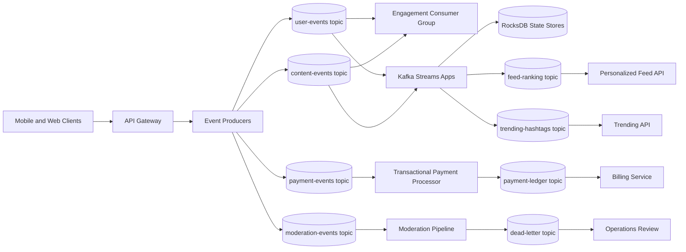
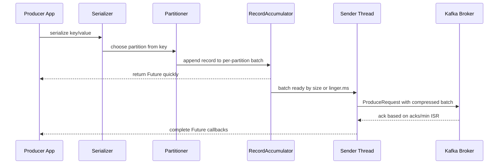
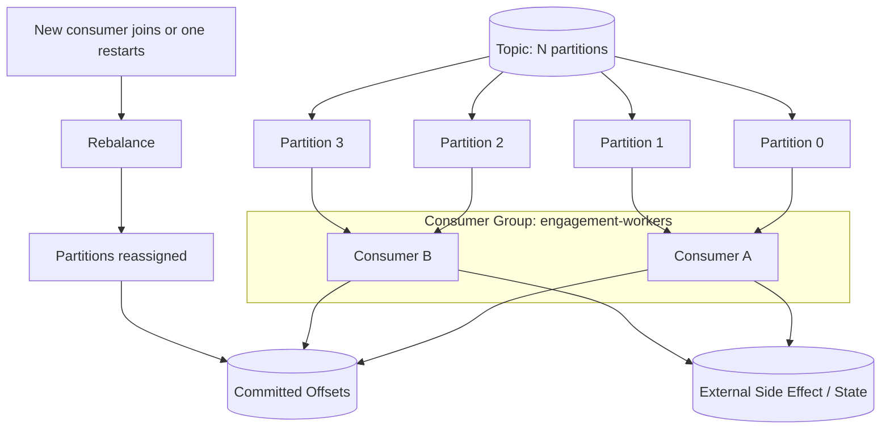
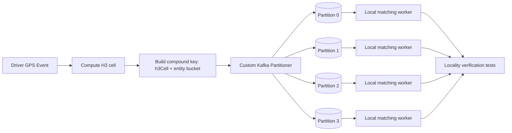
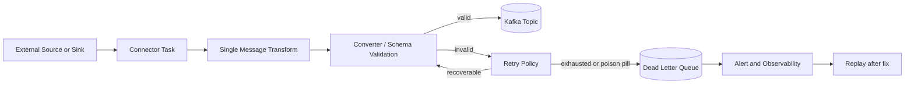

# awesome-kafka

# Hands On Kafka Substack Notes - Detailed Study Guide

Source page: https://handsonkafka.substack.com/notes  
Generated on: 2026-06-26  
Scope: public Substack archive metadata plus full structured data for posts marked `everyone` by Substack. Paid-only posts are included as title/date/teaser metadata only.

> Copyright boundary: this guide summarizes, organizes, and explains the available material. It does not reproduce the Substack posts verbatim. For paid-only entries, the detailed explanations below are topic-level study notes inferred from the public title, section, and teaser, not a substitute for subscriber content.

## Coverage Snapshot

| Item | Count |
|---|---:|
| Total archive entries found | 106 |
| Free/public posts with full page data fetched | 33 |
| Paid-only entries with metadata only | 73 |
| Date range | 2025-07-24 to 2026-06-25 |

## How To Use This Guide

1. Read the architecture diagrams first to understand the end-to-end system shape.
2. Use the full post index as a checklist; every post discovered from the archive is listed.
3. For free posts, use the extracted heading map to jump back to the original article.
4. For paid-only posts, treat the notes as a study scaffold and verify details inside Substack if you have access.
5. Use the final checklist to test whether you can design, implement, and operate the StreamSocial and Uber-Lite systems without looking at the notes.

## Big Picture: What The Publication Is Teaching

Hands On Kafka is organized around two realistic systems:

- StreamSocial: a social-media analytics and engagement platform that uses Kafka to process user actions, engagement events, feeds, recommendations, payments, moderation, connectors, streams, security, and production readiness.
- Uber-Lite: a high-scale geospatial matchmaking system that uses Kafka, custom partitioning, H3/geospatial indexing, batching, locality, simulation, and reliability patterns to move driver/rider location data without destroying cluster balance.

The common pattern is practical distributed-systems learning: start from a naive design, expose its failure mode under load, then replace it with Kafka-native mechanics such as append-only logs, partitions, keys, consumer groups, replication, batching, state stores, connect workers, ACLs, and deterministic locality verification.

## Diagram 1: StreamSocial Event-Driven Architecture

Key idea: Kafka is not just a queue between services. It is the durable event log that lets many independent consumers replay, branch, aggregate, and materialize state without forcing all writes through one synchronous database transaction path.

## Diagram 2: Kafka Producer Path And Batching

Study point: high throughput usually comes from not sending every event as a tiny network request. The RecordAccumulator, batch.size, linger.ms, compression, idempotence, and callbacks are the producer-side controls that decide whether the system behaves like a firehose or a request-response loop.

## Diagram 3: Consumer Groups, Offsets, And Rebalancing

Study point: correctness depends on when offsets are committed relative to side effects. Commit too early and a crash loses work. Commit too late and a crash repeats work. The robust pattern is idempotent processing, explicit commit strategy, and careful rebalance handling.

## Diagram 4: Uber-Lite Geospatial Partitioning Flow

Study point: geospatial systems fail when nearby entities are scattered randomly across partitions. Uber-Lite pushes spatial locality into the key and partitioner so the matching engine can process nearby drivers/riders without cross-partition fan-out on every match.

## Diagram 5: Kafka Connect Error Handling

Study point: production Kafka Connect must treat bad records as expected operational events. DLQs, retries, tolerance, schema validation, and monitoring keep a single malformed record from freezing a whole ingestion pipeline.

## Module Notes

### 1. Course Framing And StreamSocial

The course starts with a thesis: modern applications break when synchronous service calls, database bottlenecks, and ad hoc background jobs are used for high-volume interaction streams. StreamSocial gives the learning path a concrete domain: users create content, view feeds, like posts, comment, follow people, pay for features, and trigger moderation or recommendations.

Core design lessons:

- Model business facts as events: `UserRegistered`, `PostCreated`, `PostLiked`, `CommentAdded`, `PaymentCaptured`, `ModerationFlagged`.
- Keep events immutable. Corrections and reversals should be new events, not silent edits to old history.
- Separate write capture from read models. Kafka stores the event stream; downstream systems build feed indexes, analytics tables, reputation scores, and recommendation state.
- Choose topic boundaries based on ownership and throughput. Do not put unrelated data in one topic just because it is convenient.
- Use keys deliberately. Keys control ordering, partition placement, compaction semantics, and the shape of later joins.

Implementation checklist:

- Define a small event taxonomy before writing producer code.
- Pick key fields that match the ordering guarantee you need.
- Decide whether consumers can replay safely from offset zero.
- Make every consumer idempotent before adding concurrency.
- Add observability from day one: lag, failure counts, retries, DLQ volume, and end-to-end latency.

### 2. Kafka Foundations: Logs, Topics, Partitions, Brokers

Kafka's core abstraction is an append-only log split into partitions. Producers append records; consumers track offsets. Unlike a traditional queue, Kafka does not remove messages when one consumer reads them. This gives the system replay, multiple independent consumer groups, and durable history.

Important concepts:

- Topic: named stream of records.
- Partition: ordered shard of a topic. Ordering is only guaranteed within one partition.
- Offset: monotonically increasing position inside a partition.
- Broker: server that stores partitions and serves reads/writes.
- Replication factor: number of broker copies for each partition.
- Leader replica: broker replica that handles reads/writes for a partition.
- ISR: in-sync replicas eligible to become leader without acknowledged data loss.

Design tradeoffs:

- More partitions increase parallelism but add overhead, metadata, open files, and rebalance complexity.
- More replication improves resilience but increases disk and network cost.
- Ordering and parallelism pull against each other: one key gives order, many keys give throughput.

### 3. Producers: Throughput, Delivery, Idempotence, Transactions

Producer tuning is a physics problem: CPU serialization cost, compression cost, buffer memory, network round trips, broker acknowledgment policy, and retry behavior decide throughput.

Study notes:

- `acks=0` is fastest but can lose data silently.
- `acks=1` waits for the leader only; data can be lost if the leader dies before followers catch up.
- `acks=all` with a sensible `min.insync.replicas` is the usual durability setting.
- `enable.idempotence=true` prevents duplicate writes caused by retrying an uncertain produce request.
- Transactions coordinate writes to multiple partitions/topics and consumed offsets, enabling exactly-once stream processing when all participating clients are configured correctly.
- `linger.ms` can intentionally wait a little to fill batches, trading small latency for large throughput wins.
- Compression works best on batches, not single tiny records.

Failure modes to recognize:

- Retrying without idempotence can duplicate events.
- Keyless events spread randomly and destroy ordering guarantees.
- Overly small batches create high request overhead.
- Too much linger can violate latency targets.
- Treating callback errors as logs-only events hides real delivery failure.

### 4. Consumers: Groups, Commits, Backpressure, Shutdown

Consumers scale through consumer groups: partitions are assigned across group members, and each partition is consumed by at most one member in the group at a time. The hard part is not reading messages; it is committing offsets safely while handling failures, restarts, and downstream slowness.

Study notes:

- Auto-commit is convenient but often unsafe for side-effecting processors.
- Manual commit after successful processing gives better control.
- `max.poll.interval.ms`, `max.poll.records`, and processing time must be aligned or the broker will assume a consumer is unhealthy.
- Graceful shutdown should stop polling, finish in-flight records, commit safe offsets, and close the consumer.
- Rebalances pause work and can cause duplicate processing if revoke/assign callbacks are not handled.
- Static membership reduces unnecessary rebalances for predictable deployments.

Backpressure pattern:

1. Measure processing latency and consumer lag.
2. Limit poll batch size to what can be processed inside the poll interval.
3. Pause partitions when downstream systems are saturated.
4. Resume when queues drain.
5. Keep processing idempotent so retries are safe.

### 5. Reliability: Replication, ISR, Delivery Guarantees, Poison Pills

Kafka reliability is built from several layers: producer acknowledgment, broker replication, consumer offset discipline, and application idempotence. No single knob gives correctness by itself.

Study notes:

- At-most-once: commit before processing. Fast but can lose work.
- At-least-once: process before commit. Reliable but can duplicate work.
- Exactly-once: use idempotent producers, transactions, and stateful processing discipline; still requires idempotent external side effects unless those systems participate transactionally.
- Poison pills are records that always fail: invalid schema, unexpected nulls, corrupt payloads, or business-rule violations.
- DLQ is not a trash bin. It needs schema, metadata, original topic/partition/offset, error reason, and replay tooling.

Operational questions:

- What happens if a broker dies during a produce request?
- What happens if a consumer commits and then crashes before writing to the database?
- Can you replay a day's worth of events without double-charging or double-notifying users?
- Can a single bad record block an entire partition forever?

### 6. Serialization And Schema Governance

Schema management keeps event streams evolvable. Without it, producers and consumers become tightly coupled and a deployment can break unrelated services.

Study notes:

- JSON is easy to inspect but weak unless paired with schema validation.
- Avro with Schema Registry is compact and evolution-friendly.
- Protobuf gives strong contracts and multi-language support.
- Backward compatibility means new consumers can read old data.
- Forward compatibility means old consumers can skip or tolerate new fields.
- Full compatibility is stricter and useful for long-lived topics with many consumers.

Rules of thumb:

- Add optional fields with defaults.
- Do not rename fields casually; add a new field and migrate.
- Do not change semantic meaning while keeping the same name.
- Version event meaning in documentation, not just schemas.
- Test schema compatibility in CI.

### 7. Kafka Connect: Source/Sink Integration

Kafka Connect exists to move data between Kafka and external systems without each team writing a bespoke ingestion service. The course sequence covers source connectors, sink connectors, transforms, distributed deployment, observability, custom connectors, CDC with Debezium, and error handling.

Study notes:

- A connector defines the integration; tasks do the parallel work.
- Distributed mode stores configs, offsets, and statuses in Kafka internal topics.
- SMTs are best for lightweight transformations, not heavy business logic.
- CDC with Debezium turns database changes into Kafka events, but schema, deletes, snapshots, and ordering must be understood.
- Sink connectors need idempotent writes or primary-key semantics to survive retries.

Production checklist:

- Run workers in distributed mode for resilience.
- Monitor task status, restart counts, lag, and DLQ rate.
- Keep connector configs versioned.
- Size tasks based on source partitions or sink throughput, not arbitrary worker count.
- Test schema and poison-pill behavior before production.

### 8. Kafka Streams: KStream, KTable, Joins, State Stores, Processor API

Kafka Streams lets applications transform topics into derived topics and materialized views. The StreamSocial lessons use it for engagement scoring, content moderation, recommendation state, feed ranking, interactive queries, and real-time trending.

Mental model:

- KStream: event stream. Each record is a fact in time.
- KTable: changelog-backed table. Each key's latest value matters.
- GlobalKTable: replicated lookup table across app instances.
- State store: local RocksDB or in-memory data structure backed by Kafka changelog topics.
- Processor API: lower-level API for custom processing, punctuators, and state-store control.

Join patterns:

- Stream-table join: enrich events with latest reference state, such as user profile or preference data.
- Table-table join: combine materialized views, such as user preferences and content metadata.
- Windowed stream-stream join: match events that happen near each other in time.

Failure mode: stateful processing feels local, but correctness depends on changelog topics, standby replicas, partition co-location, and restore time after crashes.

### 9. Security, Observability, And Production Readiness

The later StreamSocial posts shift from feature development to operating a production Kafka platform.

Security notes:

- TLS protects data in transit and verifies broker identity.
- SASL authenticates clients.
- ACLs authorize which principals can read, write, create, alter, or describe resources.
- Principle of least privilege matters because Kafka topics often contain sensitive business events.

Observability notes:

- Broker metrics: under-replicated partitions, request latency, disk usage, network throughput, controller status.
- Producer metrics: error rate, retry rate, batch size, compression ratio, request latency, buffer exhaustion.
- Consumer metrics: lag, poll interval, rebalance count, commit latency, processing failures.
- Streams metrics: state-store restore time, task assignment, punctuator latency, changelog throughput.

Production readiness means the system has deployment resilience, capacity math, rollback paths, security, replay strategy, incident runbooks, and monitoring before traffic arrives.

### 10. Uber-Lite: Geospatial Matchmaking With Kafka

Uber-Lite is a second course track focused on spatial data and high-scale matching. It starts with the event-log architecture and then moves into geospatial indexing, H3, producer configuration, driver simulation, batching, partition locality, and verification.

Core lesson: location streams are not just high-volume event streams. They have spatial locality constraints. If a rider and nearby drivers are placed on unrelated partitions, the matching engine either misses candidates or performs expensive cross-partition queries.

Study notes:

- Naive lat/lon scans are O(n) and fail as driver count grows.
- Geohash rectangles create uneven cells and boundary artifacts.
- H3 hexagons give more uniform neighborhoods and k-ring traversal.
- Resolution controls precision versus cardinality: too coarse creates hot cells; too fine scatters nearby entities.
- A custom partitioner can map H3 cells to Kafka partitions to preserve locality.
- Compound keys can reduce hot partitions by mixing spatial cell with entity bucket while preserving enough locality.
- Boundary buffering is needed because matches near a cell edge may need adjacent cells.
- Co-partitioning requirements ensure related streams can be joined without remote lookups.

Verification mindset:

- Do not trust a partitioner by inspection. Produce controlled events and inspect resulting topic partitions.
- Create tests that prove the same H3 locality maps consistently.
- Measure skew across partitions under realistic urban distributions.
- Simulate traffic spikes in dense cells, not just uniform random movement.

## All Posts Index

| # | Date | Access | Module | Post | Visible teaser / description | Full public page fetched |
|---:|---|---|---|---|---|---|
| 1 | 2026-06-25 | Free/public | Uber-Lite geospatial systems | [Lesson 40: Locality Verification Lab — Proving the Partition Invariant Before You Build the Engine](https://handsonkafka.substack.com/p/lesson-40-locality-verification-lab) | The Naive Failure Mode | Yes |
| 2 | 2026-06-21 | Paid-only metadata | Uber-Lite geospatial systems | [Lesson 39: Co-Partitioning Requirements ](https://handsonkafka.substack.com/p/lesson-39-co-partitioning-requirements) | The Failure Mode Nobody Warns You About | No |
| 3 | 2026-06-17 | Paid-only metadata | Uber-Lite geospatial systems | [Lesson 38: Static Membership — Eliminating Rebalance Stop-The-World Pauses](https://handsonkafka.substack.com/p/lesson-38-static-membership-eliminating) | The Problem: Every Restart Is a Catastrophe | No |
| 4 | 2026-06-13 | Paid-only metadata | Uber-Lite geospatial systems | [Lesson 37: Rebalancing Events — When the Cluster Breathes](https://handsonkafka.substack.com/p/lesson-37-rebalancing-events-when) | The Naive Approach: How Your Dispatcher Stalls at 3 AM | No |
| 5 | 2026-06-09 | Paid-only metadata | Uber-Lite geospatial systems | [Lesson 36: Replication Factors — The Physics of Surviving Broker Death](https://handsonkafka.substack.com/p/lesson-36-replication-factors-the) | The Naive Approach (And Why It Kills Your Dispatch Engine at 3am) | No |
| 6 | 2026-06-06 | Paid-only metadata | Weekly integrated labs | [Week 2 : Build a Consumer Reliability Stack That Survives Real Traffic](https://handsonkafka.substack.com/p/week-2-build-a-consumer-reliability) | What we build today | No |
| 7 | 2026-06-05 | Free/public | Uber-Lite geospatial systems | [Lesson 35: Topic Inspection — Proving Your Geo-Partitioner Isn’t Lying to You](https://handsonkafka.substack.com/p/lesson-35-topic-inspection-proving) | The Problem with Trust | Yes |
| 8 | 2026-06-01 | Paid-only metadata | Uber-Lite geospatial systems | [Lesson 34: Boundary Buffering — Correctness Across Partition Lines](https://handsonkafka.substack.com/p/lesson-34-boundary-buffering-correctness) | The Problem Nobody Talks About | No |
| 9 | 2026-05-29 | Free/public | Weekly integrated labs | [Week 1: Event-Driven Architecture & Kafka Foundations (Days 1–5)(integrated)](https://handsonkafka.substack.com/p/week-1-event-driven-architecture) | 1. Introduction | Yes |
| 10 | 2026-05-28 | Paid-only metadata | Uber-Lite geospatial systems | [Lesson 33: The Boundary Problem](https://handsonkafka.substack.com/p/lesson-33-the-boundary-problem) | The Naive Approach: How Your System Is Already Failing | No |
| 11 | 2026-05-24 | Paid-only metadata | Uber-Lite geospatial systems | [Lesson 32: Skew Mitigation Strategies — When to Over-Engineer and When to Stop](https://handsonkafka.substack.com/p/lesson-32-skew-mitigation-strategies) | The Naive Approach: How Standard Partitioning Destroys Your Cluster at Scale | No |
| 12 | 2026-05-20 | Paid-only metadata | Uber-Lite geospatial systems | [Lesson 31: The "Manhattan" Skew Problem](https://handsonkafka.substack.com/p/lesson-31-the-manhattan-skew-problem) | The Failure Mode Nobody Talks About | No |
| 13 | 2026-05-16 | Free/public | Uber-Lite geospatial systems | [Lesson 30: Configuring the Producer — Wiring H3Partitioner Into the Pipeline](https://handsonkafka.substack.com/p/lesson-30-configuring-the-producer) | The Naive Approach (And Why It Explodes at Scale) | Yes |
| 14 | 2026-05-12 | Paid-only metadata | Uber-Lite geospatial systems | [Lesson 29: Implementing the H3-Based Custom Kafka Partitioner](https://handsonkafka.substack.com/p/lesson-29-implementing-the-h3-based) | The Problem: Why DefaultPartitioner Destroys Geo-Spatial Joins | No |
| 15 | 2026-05-08 | Paid-only metadata | Uber-Lite geospatial systems | [Lesson 28: Defining the Partition Key](https://handsonkafka.substack.com/p/lesson-28-defining-the-partition) | H3 Resolution 3 Cells as Kafka Routing Contracts | No |
| 16 | 2026-05-04 | Paid-only metadata | Uber-Lite geospatial systems | [Lesson 27: Kafka Streams Partitioning — H3-Based Spatial Co-location](https://handsonkafka.substack.com/p/lesson-27-kafka-streams-partitioning) | The Constraint You Can’t Abstract Away | No |
| 17 | 2026-04-30 | Paid-only metadata | Uber-Lite geospatial systems | [Lesson 26: The Data Locality Principle](https://handsonkafka.substack.com/p/lesson-26-the-data-locality-principle) | Why Your Kafka Join Is Making a Network Call It Shouldn’t | No |
| 18 | 2026-04-26 | Free/public | Uber-Lite geospatial systems | [Lesson 25: The Firehose Capstone — 10k Drivers, 3,333 msg/sec, Zero Errors](https://handsonkafka.substack.com/p/lesson-25-the-firehose-capstone-10k) | The Module 2 Contract | Yes |
| 19 | 2026-04-22 | Paid-only metadata | Uber-Lite geospatial systems | [Lesson 24: Stress Testing the Cluster — Proving Your Environment Holds at 5k Events/Sec](https://handsonkafka.substack.com/p/lesson-24-stress-testing-the-cluster) | Why This Lesson Exists | No |
| 20 | 2026-04-18 | Paid-only metadata | Uber-Lite geospatial systems | [Lesson 23: Deterministic Data Generation](https://handsonkafka.substack.com/p/lesson-23-deterministic-data-generation) | The “I Can’t Repro This” Problem | No |
| 21 | 2026-04-14 | Paid-only metadata | Uber-Lite geospatial systems | [Lesson 22: Metrics Instrumentation — Observability Without Overhead](https://handsonkafka.substack.com/p/lesson-22-metrics-instrumentation) | The Naive Approach: Logging Your Way to Production Hell | No |
| 22 | 2026-04-10 | Paid-only metadata | Uber-Lite geospatial systems | [Lesson 21: Handling Simulation Backpressure](https://handsonkafka.substack.com/p/lesson-21-handling-simulation-backpressure) | The Naive Approach: Why Your Simulator Will OOM at Scale | No |
| 23 | 2026-04-06 | Free/public | Uber-Lite geospatial systems | [Lesson 20: Concurrency Simulation – Virtual Threads vs Scheduled Executor Service](https://handsonkafka.substack.com/p/lesson-20-concurrency-simulation) | The Naive Approach: Why Single-Threaded Simulation Fails | Yes |
| 24 | 2026-04-01 | Paid-only metadata | Uber-Lite geospatial systems | [Lesson 19: Path Interpolation – Reconstructing Continuous Movement from Discrete GPS Samples](https://handsonkafka.substack.com/p/lesson-19-path-interpolation-reconstructing) | The Naive Approach: Why Point-to-Point Updates Fail at Scale | No |
| 25 | 2026-03-28 | Paid-only metadata | Uber-Lite geospatial systems | [Lesson 18: Modeling the Driver – H3-Aware Movement vs Lat/Lon Chaos](https://handsonkafka.substack.com/p/lesson-18-modeling-the-driver-h3) | The Naive Approach: Why Random Coordinates Kill Your Cluster | No |
| 26 | 2026-03-25 | Paid-only metadata | Uber-Lite geospatial systems | [Lesson 17: Compression Algorithms - The Physics of Batch Compression in Geospatial Streams](https://handsonkafka.substack.com/p/lesson-17-compression-algorithms) | The Naive Approach: Why Uncompressed JSON Kills Production | No |
| 27 | 2026-03-21 | Paid-only metadata | Uber-Lite geospatial systems | [Lesson 16: Artificial Latency (linger.ms) — The Producer Batching Lever](https://handsonkafka.substack.com/p/lesson-16-artificial-latency-lingerms) | The Naive Approach: Death by a Thousand Pings | No |
| 28 | 2026-03-19 | Free/public | Production, security, observability | [Day 60: System Integration & Production Readiness](https://handsonkafka.substack.com/p/day-60-system-integration-and-production) | Taking StreamSocial to Production at Scale | Yes |
| 29 | 2026-03-17 | Free/public | Uber-Lite geospatial systems | [Lesson 15: Batching Physics - The Record Accumulator's Role in High-Velocity Geo-Spatial Streams](https://handsonkafka.substack.com/p/lesson-15-batching-physics-the-record) | The Naive Approach: Why 3,000 Events/Sec Crashes Your System | Yes |
| 30 | 2026-03-15 | Paid-only metadata | Production, security, observability | [Day 59: Advanced Ecosystem Tools - Real-Time Analytics with ksqlDB](https://handsonkafka.substack.com/p/day-59-advanced-ecosystem-tools-real) | What We’re Building Today | No |
| 31 | 2026-03-13 | Paid-only metadata | Uber-Lite geospatial systems | [Lesson 14: Asynchronous I/O – Why Synchronous Send() Kills Throughput](https://handsonkafka.substack.com/p/lesson-14-asynchronous-io-why-synchronous) | The Naive Approach: Synchronous Send and the Throughput Ceiling | No |
| 32 | 2026-03-11 | Paid-only metadata | Production, security, observability | [Day 58: Schema Governance - Managing StreamSocial’s Evolution Without Breaking Production](https://handsonkafka.substack.com/p/day-58-schema-governance-managing) | What We’re Building Today | No |
| 33 | 2026-03-09 | Paid-only metadata | Uber-Lite geospatial systems | [Lesson 13: The Kafka Producer API – Engineering for 3,000+ Events/Second](https://handsonkafka.substack.com/p/lesson-13-the-kafka-producer-api) | The Naive Approach: Why Your First Producer Dies at 200 req/sec | No |
| 34 | 2026-03-07 | Paid-only metadata | Production, security, observability | [Day 57: Microservices Event Architecture](https://handsonkafka.substack.com/p/day-57-microservices-event-architecture) | Nothing teaches better than “Code in Action”. | No |
| 35 | 2026-03-05 | Paid-only metadata | Uber-Lite geospatial systems | [Lesson 12: Topic Engineering – The Immutable Scaling Contract](https://handsonkafka.substack.com/p/lesson-12-topic-engineering-the-immutable) | The Naive Approach: “Let’s Start Small” | No |
| 36 | 2026-03-03 | Paid-only metadata | Production, security, observability | [Day 56: Encryption & TLS - Protecting StreamSocial’s Data in Flight](https://handsonkafka.substack.com/p/day-56-encryption-and-tls-protecting) | What We’re Building Today | No |
| 37 | 2026-03-01 | Paid-only metadata | Uber-Lite geospatial systems | [Lesson 11: Configuration Architecture for Distributed Streaming Systems](https://handsonkafka.substack.com/p/lesson-11-configuration-architecture) | The Naive Approach: How Single-Environment Config Crashes Production | No |
| 38 | 2026-02-27 | Free/public | Production, security, observability | [Day 55: Authorization with ACLs - Who Gets to Touch What in StreamSocial](https://handsonkafka.substack.com/p/day-55-authorization-with-acls-who) | What We’re Building Today | Yes |
| 39 | 2026-02-25 | Free/public | Uber-Lite geospatial systems | [Lesson 10: Production-Grade Dependency Management for Kafka Streams with Native Libraries](https://handsonkafka.substack.com/p/lesson-10-production-grade-dependency) | The Naive Approach (Why It Fails at Scale) | Yes |
| 40 | 2026-02-23 | Paid-only metadata | Production, security, observability | [Day 54: Authentication with SASL - Securing StreamSocial’s Event Pipeline](https://handsonkafka.substack.com/p/day-54-authentication-with-sasl-securing) | Today’s Build Agenda | No |
| 41 | 2026-02-21 | Paid-only metadata | Uber-Lite geospatial systems | [Lesson 9: Project Initialization - Building Production-Grade Kafka Infrastructure](https://handsonkafka.substack.com/p/lesson-9-project-initialization-building) | The Naive Approach (And Why It Fails at Scale) | No |
| 42 | 2026-02-19 | Paid-only metadata | Production, security, observability | [Day 53: Centralized Logging Strategy - Debugging StreamSocial at Scale](https://handsonkafka.substack.com/p/day-53-centralized-logging-strategy) | What We’re Building Today | No |
| 43 | 2026-02-16 | Paid-only metadata | Uber-Lite geospatial systems | [Lesson 8: Infrastructure Setup - Docker Multi-Broker Kafka Cluster](https://handsonkafka.substack.com/p/lesson-8-infrastructure-setup-docker) | The Naive Approach (And Why It Destroys Your Weekend) | No |
| 44 | 2026-02-15 | Paid-only metadata | Production, security, observability | [Day 52: Client Metrics & Observability](https://handsonkafka.substack.com/p/day-52-client-metrics-and-observability) | What You’ll Build Today | No |
| 45 | 2026-02-12 | Paid-only metadata | Uber-Lite geospatial systems | [Lesson 7: H3 Resolution Strategy - The Cardinality vs. Precision Tradeoff](https://handsonkafka.substack.com/p/lesson-7-h3-resolution-strategy-the) | The Naive Approach: Death by a Million Empty Cells | No |
| 46 | 2026-02-11 | Paid-only metadata | Production, security, observability | [Day 51: Broker Monitoring & Metrics - The Control Tower for StreamSocial’s 50M req/s Infrastructure](https://handsonkafka.substack.com/p/day-51-broker-monitoring-and-metrics) | What We’re Building Today | No |
| 47 | 2026-02-08 | Paid-only metadata | Uber-Lite geospatial systems | [Lesson 6: Introduction to Uber H3 - Hexagonal Spatial Indexing](https://handsonkafka.substack.com/p/lesson-6-introduction-to-uber-h3) | The Naive Approach (And Why It Dies at Scale) | No |
| 48 | 2026-02-07 | Free/public | Kafka Streams and stateful processing | [Day 50: Processor API - Building ML-Powered Content Recommendations](https://handsonkafka.substack.com/p/day-50-processor-api-building-ml) | What We’re Building Today | Yes |
| 49 | 2026-02-04 | Free/public | Uber-Lite geospatial systems | [Lesson 5: The Limits of Geohash - Why Uber Ditched Rectangles for Hexagons](https://handsonkafka.substack.com/p/lesson-5-the-limits-of-geohash-why) | The Naive Approach: Geohash Everywhere | Yes |
| 50 | 2026-02-03 | Paid-only metadata | Kafka Streams and stateful processing | [Day 49: Fault Tolerance & Recovery in Kafka Streams](https://handsonkafka.substack.com/p/day-49-fault-tolerance-and-recovery) | Building Bullet-Proof Engagement Scoring for StreamSocial | No |
| 51 | 2026-01-31 | Free/public | Uber-Lite geospatial systems | [Lesson 4: Geospatial Indexing 101 - Why Scanning is Death](https://handsonkafka.substack.com/p/lesson-4-geospatial-indexing-101) | The Naive Approach: Linear Distance Scanning | Yes |
| 52 | 2026-01-28 | Paid-only metadata | Kafka Streams and stateful processing | [Day 48: Interactive Queries - Building StreamSocial’s Live Trending API](https://handsonkafka.substack.com/p/day-48-interactive-queries-building) | What We’re Building Today | No |
| 53 | 2026-01-27 | Free/public | Uber-Lite geospatial systems | [Lesson 3: Kafka Architecture Mechanics - Durability Without Performance Death](https://handsonkafka.substack.com/p/lesson-3-kafka-architecture-mechanics) | The Problem: Replication is Not High Availability | Yes |
| 54 | 2026-01-24 | Paid-only metadata | Kafka Streams and stateful processing | [Day 47: Table-Table Joins - Matching User Preferences with Content Metadata](https://handsonkafka.substack.com/p/day-47-table-table-joins-matching) | What We’re Building Today | No |
| 55 | 2026-01-22 | Free/public | Uber-Lite geospatial systems | [Lesson 2: The Log Abstraction - Why Kafka Isn't a Queue](https://handsonkafka.substack.com/p/lesson-2-the-log-abstraction-why) | The Naive Approach: Treating Kafka Like RabbitMQ | Yes |
| 56 | 2026-01-20 | Paid-only metadata | Kafka Streams and stateful processing | [Day 46: Stream-Table Joins - Enriching Events in Real-Time](https://handsonkafka.substack.com/p/day-46-stream-table-joins-enriching) | What We’re Building Today | No |
| 57 | 2026-01-18 | Free/public | Uber-Lite geospatial systems | [Lesson 1: The Monolith vs. The Event Log](https://handsonkafka.substack.com/p/lesson-1-the-monolith-vs-the-event) | The Naive Approach: PostgreSQL as a Write-Through Cache | Yes |
| 58 | 2026-01-16 | Free/public | Kafka Streams and stateful processing | [Day 45: KTable Operations - Real-Time User Reputation System](https://handsonkafka.substack.com/p/day-45-ktable-operations-real-time) | What We’re Building Today | Yes |
| 59 | 2026-01-13 | Free/public | Uber-Lite geospatial systems | [Uber-Lite: Architecting High-Scale Geo-Spatial Matchmaking Systems](https://handsonkafka.substack.com/p/uber-lite-architecting-high-scale) | This isn’t a course on how to build a ride-sharing clone; it is a masterclass in handling high-velocity spatia | Yes |
| 60 | 2026-01-08 | Paid-only metadata | Kafka Streams and stateful processing | [Day 44: Stateful Aggregations - Real-Time Trending Hashtag Detection](https://handsonkafka.substack.com/p/day-44-stateful-aggregations-real) | What We’re Building Today | No |
| 61 | 2026-01-05 | Paid-only metadata | Kafka Streams and stateful processing | [Day 43: Stateless Transformations - Building StreamSocial’s Content Moderation Pipeline](https://handsonkafka.substack.com/p/day-43-stateless-transformations) | What We’re Building Today | No |
| 62 | 2026-01-01 | Paid-only metadata | Kafka Connect and integration | [Day 39: Database Integration Patterns](https://handsonkafka.substack.com/p/day-39-database-integration-patterns) | What We’re Building Today | No |
| 63 | 2026-01-01 | Paid-only metadata | Kafka Streams and stateful processing | [Day 42: KStream Processing - User Interaction Stream for Feed Ranking](https://handsonkafka.substack.com/p/day-42-kstream-processing-user-interaction) | What We’re Building Today | No |
| 64 | 2025-12-28 | Paid-only metadata | Kafka Connect and integration | [Day 38: Change Data Capture with Debezium](https://handsonkafka.substack.com/p/day-38-change-data-capture-with-debezium) | What We’re Building Today | No |
| 65 | 2025-12-28 | Free/public | Kafka Connect and integration | [Day 40: Error Handling in Connect - When Content Moderation Fails](https://handsonkafka.substack.com/p/day-40-error-handling-in-connect) | Today’s Build Agenda | Yes |
| 66 | 2025-12-28 | Paid-only metadata | Kafka Streams and stateful processing | [Day 41: Kafka Streams Fundamentals - Real-Time Engagement Scoring Engine](https://handsonkafka.substack.com/p/day-41-kafka-streams-fundamentals) | What We’re Building Today | No |
| 67 | 2025-12-24 | Paid-only metadata | Kafka Connect and integration | [Day 37: Custom Connector Development](https://handsonkafka.substack.com/p/day-37-custom-connector-development) | Building Your Own Integration Pipeline for StreamSocial | No |
| 68 | 2025-12-20 | Paid-only metadata | Kafka Connect and integration | [Day 36: Connect Monitoring & Observability](https://handsonkafka.substack.com/p/day-36-connect-monitoring-and-observability) | What We’re Building Today | No |
| 69 | 2025-12-16 | Free/public | Kafka Connect and integration | [Day 35: Distributed Connect Deployment](https://handsonkafka.substack.com/p/day-35-distributed-connect-deployment) | What We’re Building Today | Yes |
| 70 | 2025-12-11 | Paid-only metadata | Kafka Connect and integration | [Day 34: Single Message Transformations](https://handsonkafka.substack.com/p/day-34-single-message-transformations) | Today’s Learning Objectives | No |
| 71 | 2025-12-08 | Paid-only metadata | Kafka Connect and integration | [Day 33: Sink Connector Development](https://handsonkafka.substack.com/p/day-33-sink-connector-development) | What You’ll Build Today | No |
| 72 | 2025-12-04 | Paid-only metadata | Kafka Connect and integration | [Day 32: Source Connector Implementation](https://handsonkafka.substack.com/p/day-32-source-connector-implementation) | What We’re Building Today | No |
| 73 | 2025-11-30 | Paid-only metadata | Kafka Connect and integration | [Day 31: Kafka Connect Architecture](https://handsonkafka.substack.com/p/day-31-kafka-connect-architecture) | What We’re Building Today | No |
| 74 | 2025-11-26 | Free/public | Reliability, serialization, compaction | [Day 30: Kafka Log Compaction - User Preference State Management](https://handsonkafka.substack.com/p/day-30-kafka-log-compaction-user) | What We’re Building Today | Yes |
| 75 | 2025-11-22 | Paid-only metadata | Reliability, serialization, compaction | [Day 29: Schema Evolution Strategies](https://handsonkafka.substack.com/p/day-29-schema-evolution-strategies) | What We’re Building Today | No |
| 76 | 2025-11-18 | Paid-only metadata | Reliability, serialization, compaction | [Day 28: Protocol Buffers Integration](https://handsonkafka.substack.com/p/day-28-protocol-buffers-integration) | What We’re Building Today | No |
| 77 | 2025-11-14 | Paid-only metadata | Reliability, serialization, compaction | [Day 27: Avro Serialization & Schema Registry](https://handsonkafka.substack.com/p/lesson-27-advanced-stream-processing) | What We’re Building Today | No |
| 78 | 2025-11-10 | Paid-only metadata | Reliability, serialization, compaction | [Day 26: Schema Definition with JSON Schema](https://handsonkafka.substack.com/p/day-26-schema-definition-with-json) | Today’s Build Agenda | No |
| 79 | 2025-11-06 | Free/public | Reliability, serialization, compaction | [Day 25: Error Handling & Poison Pills](https://handsonkafka.substack.com/p/day-25-error-handling-and-poison) | Today’s Build Agenda | Yes |
| 80 | 2025-11-02 | Paid-only metadata | Reliability, serialization, compaction | [Day 24: Message Headers & Metadata](https://handsonkafka.substack.com/p/day-24-message-headers-and-metadata) | What We’re Building Today | No |
| 81 | 2025-10-29 | Paid-only metadata | Reliability, serialization, compaction | [Day 23: Graceful Shutdown Patterns](https://handsonkafka.substack.com/p/day-23-graceful-shutdown-patterns) | What We’ll Build Today | No |
| 82 | 2025-10-25 | Paid-only metadata | Reliability, serialization, compaction | [Day 22: Low-Latency Consumer Optimization](https://handsonkafka.substack.com/p/day-22-low-latency-consumer-optimization) | What We’re Building Today | No |
| 83 | 2025-10-21 | Paid-only metadata | Reliability, serialization, compaction | [Day 21: Manual Partition Assignment - StreamSocial Trend Analysis Workers](https://handsonkafka.substack.com/p/day-21-manual-partition-assignment) | What We’re Building Today | No |
| 84 | 2025-10-17 | Free/public | Reliability, serialization, compaction | [Day 20: Kafka Replication & ISR Management](https://handsonkafka.substack.com/p/day-20-kafka-replication-and-isr) | What We're Building Today | Yes |
| 85 | 2025-10-13 | Paid-only metadata | Reliability, serialization, compaction | [Day 19: Asynchronous Operations & Callbacks](https://handsonkafka.substack.com/p/day-19-asynchronous-operations-and) | What We're Building Today | No |
| 86 | 2025-10-09 | Paid-only metadata | Reliability, serialization, compaction | [Day 18: Transactional Producers - Atomic Social Media Operations](https://handsonkafka.substack.com/p/day-18-transactional-producers-atomic) | What We're Building Today | No |
| 87 | 2025-10-05 | Paid-only metadata | Reliability, serialization, compaction | [Day 17: Compression Strategies - StreamSocial Bandwidth Optimization](https://handsonkafka.substack.com/p/day-17-compression-strategies-streamsocial) | Today's Mission: Making Every Byte Count | No |
| 88 | 2025-10-01 | Paid-only metadata | Reliability, serialization, compaction | [Day 16: Batching & Throughput Optimization](https://handsonkafka.substack.com/p/day-16-batching-and-throughput-optimization) | Today’s Mission | No |
| 89 | 2025-09-27 | Free/public | Kafka foundations, producers, consumers | [Day 15: Custom Partitioning Logic - StreamSocial Geographic Distribution](https://handsonkafka.substack.com/p/day-15-custom-partitioning-logic) | Working Code Demo: | Yes |
| 90 | 2025-09-23 | Paid-only metadata | Kafka foundations, producers, consumers | [Day 14: Message Ordering & Keys - StreamSocial Timeline Consistency](https://handsonkafka.substack.com/p/day-14-message-ordering-and-keys) | Working Code Demo: | No |
| 91 | 2025-09-19 | Paid-only metadata | Kafka foundations, producers, consumers | [Day 13: Idempotent Producers - Bulletproof Your StreamSocial Posts](https://handsonkafka.substack.com/p/day-13-idempotent-producers-bulletproof) | Today's Build Agenda | No |
| 92 | 2025-09-15 | Paid-only metadata | Kafka foundations, producers, consumers | [Day 12: Retry Logic & Failure Handling](https://handsonkafka.substack.com/p/day-12-retry-logic-and-failure-handling) | Today's Build Agenda | No |
| 93 | 2025-09-11 | Paid-only metadata | Kafka foundations, producers, consumers | [Day 11: Producer Acknowledgment Strategies](https://handsonkafka.substack.com/p/day-11-producer-acknowledgment-strategies) | What We're Building Today | No |
| 94 | 2025-09-07 | Free/public | Kafka foundations, producers, consumers | [Day 10: Delivery Guarantees - Building Exactly-Once Payment Processing](https://handsonkafka.substack.com/p/day-10-delivery-guarantees-building) | What We're Building Today | Yes |
| 95 | 2025-09-03 | Paid-only metadata | Kafka foundations, producers, consumers | [Day 9: Dynamic Consumer Rebalancing - StreamSocial Feed Scaling](https://handsonkafka.substack.com/p/day-9-dynamic-consumer-rebalancing) | The Problem We're Solving | No |
| 96 | 2025-08-30 | Paid-only metadata | Kafka foundations, producers, consumers | [Day 8: Building Reliable Engagement Processing with Manual Commit Strategies](https://handsonkafka.substack.com/p/day-8-building-reliable-engagement) | The Problem We're Solving | No |
| 97 | 2025-08-26 | Paid-only metadata | Kafka foundations, producers, consumers | [Day 7: Offset Management Strategies - StreamSocial Analytics](https://handsonkafka.substack.com/p/day-7-offset-management-strategies) | Register for annual subscription Now & Get free copies best selling Systemdr books | No |
| 98 | 2025-08-22 | Paid-only metadata | Kafka foundations, producers, consumers | [Day 6 Kafka Mastery: Consumer Groups & Scalability](https://handsonkafka.substack.com/p/day-6-kafka-mastery-consumer-groups) | This Lesson Addresses | No |
| 99 | 2025-08-18 | Free/public | Kafka foundations, producers, consumers | [Day 5: Engagement Consumer Development ](https://handsonkafka.substack.com/p/day-5-engagement-consumer-development) | This Lesson Addresses | Yes |
| 100 | 2025-08-14 | Free/public | Kafka foundations, producers, consumers | [Day 4: High-Volume Producer Implementation](https://handsonkafka.substack.com/p/day-4-high-volume-producer-implementation) | What You'll Build Today | Yes |
| 101 | 2025-08-10 | Free/public | Kafka foundations, producers, consumers | [Day 3: Topics & Partitions Strategy - StreamSocial's Parallel Universe](https://handsonkafka.substack.com/p/day-3-topics-and-partitions-strategy) | What We're Building: | Yes |
| 102 | 2025-08-06 | Free/public | Kafka foundations, producers, consumers | [Day 2: Kafka Cluster Setup - Multi-Broker Architecture](https://handsonkafka.substack.com/p/day-2-kafka-cluster-setup-multi-broker) | What We're Building Today | Yes |
| 103 | 2025-08-02 | Free/public | Kafka foundations, producers, consumers | [Day 1: Event-Driven Architecture Fundamentals](https://handsonkafka.substack.com/p/day-1-event-driven-architecture-fundamentals) | What We're Building Today | Yes |
| 104 | 2025-07-30 | Free/public | Course overview and framing | [Kafka Mastery: Building StreamSocial](https://handsonkafka.substack.com/p/kafka-mastery-building-streamsocial) | Course Overview | Yes |
| 105 | 2025-07-24 | Free/public | Course overview and framing | [The Silent Infrastructure Crisis That's Breaking Modern Applications](https://handsonkafka.substack.com/p/the-silent-infrastructure-crisis) | Mastering the Infrastructure Patterns That Reshape Modern Applications | Yes |
| 106 | 2025-07-24 | Free/public | Course overview and framing | [Coming soon](https://handsonkafka.substack.com/p/coming-soon) | This is Hands On Kafka . | Yes |

## Public Posts: Extracted Heading Map

The following entries had full public page data available. The heading lists are extracted from the public page structure and are useful as a navigation map back to the original source.

### Lesson 40: Locality Verification Lab — Proving the Partition Invariant Before You Build the Engine
- Date: 2026-06-25
- Source: https://handsonkafka.substack.com/p/lesson-40-locality-verification-lab
- Public headings extracted: The Naive Failure Mode; Why Locality Is a Hard Physical Requirement; Compound Key Anatomy: h3CellRes5\|entityId%8; The Partitioner: Hashing Only What Matters; The 6-Test Verification Suite; GitHub Link; Production Metrics: What Fails Without This Test; Running the Lab
- Study takeaway: The Naive Failure Mode

### Lesson 35: Topic Inspection — Proving Your Geo-Partitioner Isn’t Lying to You
- Date: 2026-06-05
- Source: https://handsonkafka.substack.com/p/lesson-35-topic-inspection-proving
- Public headings extracted: The Problem with Trust; The Naive Approach (And Why It Fails); The Uber-Lite Approach: Programmatic Partition Audit; Implementation Deep-Dive; GitHub Link; assign() vs subscribe(): The Physics Difference; H3 Centroid Classification; Deterministic Test Data
- Study takeaway: The Problem with Trust

### Week 1: Event-Driven Architecture & Kafka Foundations (Days 1–5)(integrated)
- Date: 2026-05-29
- Source: https://handsonkafka.substack.com/p/week-1-event-driven-architecture
- Public headings extracted: 1. Introduction; 2. System Overview; High-level components; How events move through the system; 3. Architecture Diagram; 4. Core Concepts and Their Role; Working Demo Link :; 4.1 Event-Driven Architecture
- Study takeaway: 1.

### Lesson 30: Configuring the Producer — Wiring H3Partitioner Into the Pipeline
- Date: 2026-05-16
- Source: https://handsonkafka.substack.com/p/lesson-30-configuring-the-producer
- Public headings extracted: The Naive Approach (And Why It Explodes at Scale); The Uber-Lite Architecture: H3-Based Geographic Partitioning; Implementation Deep Dive; The Partitioner Contract; Wiring Into KafkaProducer (Standalone); Wiring Into Kafka Streams; The application.yml Pattern (Without Spring); Production Metrics to Watch
- Study takeaway: The Naive Approach (And Why It Explodes at Scale)

### Lesson 25: The Firehose Capstone — 10k Drivers, 3,333 msg/sec, Zero Errors
- Date: 2026-04-26
- Source: https://handsonkafka.substack.com/p/lesson-25-the-firehose-capstone-10k
- Public headings extracted: The Module 2 Contract; The Naive Approach: Death by a Thousand Network Round-Trips; The Uber-Lite Architecture: Align Data With Hardware; 1. Virtual Threads as the Driver Fleet; 2. RecordAccumulator: Let the Batches Fill; 3. H3 Spatial Routing: Cell as Partition Key; 4. RocksDB: Absorb 10k Concurrent Driver Writes; Implementation Deep Dive
- Study takeaway: The Module 2 Contract

### Lesson 20: Concurrency Simulation – Virtual Threads vs Scheduled Executor Service
- Date: 2026-04-06
- Source: https://handsonkafka.substack.com/p/lesson-20-concurrency-simulation
- Public headings extracted: The Naive Approach: Why Single-Threaded Simulation Fails; The Uber-Lite Architecture: Virtual Threads + Batching; Implementation Deep Dive; Virtual Thread Creation; Producer Configuration for Batching; Partitioning Strategy; Production Metrics; JVM Metrics (via JFR)
- Study takeaway: The Naive Approach: Why Single-Threaded Simulation Fails

### Day 60: System Integration & Production Readiness
- Date: 2026-03-19
- Source: https://handsonkafka.substack.com/p/day-60-system-integration-and-production
- Public headings extracted: Taking StreamSocial to Production at Scale; What We’re Building Today; Production Readiness: What It Really Means; The Three Pillars of Production Systems; Pillar 1: Deployment Resilience; Pillar 2: Capacity Planning with Mathematics; Pillar 3: Disaster Recovery Without Hope; StreamSocial Production Architecture
- Study takeaway: Taking StreamSocial to Production at Scale

### Lesson 15: Batching Physics - The Record Accumulator's Role in High-Velocity Geo-Spatial Streams
- Date: 2026-03-17
- Source: https://handsonkafka.substack.com/p/lesson-15-batching-physics-the-record
- Public headings extracted: The Naive Approach: Why 3,000 Events/Sec Crashes Your System; The Uber-Lite Architecture: RecordAccumulator-Based Batching; 1. RecordAccumulator (The Staging Buffer); 2. Sender Thread (The Network Dispatcher); 3. MemoryPool (Backpressure Control); Implementation Deep Dive; Tuning Batch Size for Geo-Spatial Workloads; The Linger Dance: Latency vs Throughput
- Study takeaway: The Naive Approach: Why 3,000 Events/Sec Crashes Your System

### Day 55: Authorization with ACLs - Who Gets to Touch What in StreamSocial
- Date: 2026-02-27
- Source: https://handsonkafka.substack.com/p/day-55-authorization-with-acls-who
- Public headings extracted: What We’re Building Today; Why ACLs Matter at Scale; Core Concepts: Kafka Access Control Lists; How Kafka ACLs Work; ACL Permission Model; Resource Hierarchy; StreamSocial Architecture: Service-Level Access Control; Service Roles in StreamSocial
- Study takeaway: What We’re Building Today

### Lesson 10: Production-Grade Dependency Management for Kafka Streams with Native Libraries
- Date: 2026-02-25
- Source: https://handsonkafka.substack.com/p/lesson-10-production-grade-dependency
- Public headings extracted: The Naive Approach (Why It Fails at Scale); The Uber-Lite Architecture: Strict Dependency Locking; 1. Version Alignment Enforcement; 2. Transitive Dependency Exclusion; 3. Strict Conflict Resolution; Implementation Deep Dive: Native Library Loading Mechanics; JNI Loading Sequence; Platform-Specific Binaries
- Study takeaway: The Naive Approach (Why It Fails at Scale)

### Day 50: Processor API - Building ML-Powered Content Recommendations
- Date: 2026-02-07
- Source: https://handsonkafka.substack.com/p/day-50-processor-api-building-ml
- Public headings extracted: What We’re Building Today; Why Netflix, Spotify, and YouTube Use the Processor API; The Architecture: StreamSocial’s Recommendation Engine; Core Concept: The Processor API vs. DSL; Why Custom State Stores Matter; How It Works: Processing Flow; Real-World Pattern: Multi-Factor Content Scoring; State Management Deep Dive
- Study takeaway: What We’re Building Today

### Lesson 5: The Limits of Geohash - Why Uber Ditched Rectangles for Hexagons
- Date: 2026-02-04
- Source: https://handsonkafka.substack.com/p/lesson-5-the-limits-of-geohash-why
- Public headings extracted: The Naive Approach: Geohash Everywhere; The Uber-Lite Architecture: Exposing Geohash Distortion; Implementation Deep Dive; Geohash Structure; Custom Partitioner Implementation; Measuring Partition Skew; The Neighbor Search Problem; Comparing with H3
- Study takeaway: The Naive Approach: Geohash Everywhere

### Lesson 4: Geospatial Indexing 101 - Why Scanning is Death
- Date: 2026-01-31
- Source: https://handsonkafka.substack.com/p/lesson-4-geospatial-indexing-101
- Public headings extracted: The Naive Approach: Linear Distance Scanning; The Uber-Lite Architecture: H3 Hexagonal Indexing; Resolution Levels and Partitioning Strategy; Data Flow Through Repartitioning; K-Ring Search Mechanics; H3 K-Ring Algorithm and RocksDB Range Scan; Implementation Deep Dive; GitHub Link
- Study takeaway: The Naive Approach: Linear Distance Scanning

### Lesson 3: Kafka Architecture Mechanics - Durability Without Performance Death
- Date: 2026-01-27
- Source: https://handsonkafka.substack.com/p/lesson-3-kafka-architecture-mechanics
- Public headings extracted: The Problem: Replication is Not High Availability; The Naive Approach: Replication Theater; Broker Cluster Topology; Path with ISR Replication; The Uber-Lite Architecture: Mechanical Durability; H3-Based Geographic Partitioning; Implementation Deep Dive: The Replication State Machine; GitHub Link
- Study takeaway: The Problem: Replication is Not High Availability

### Lesson 2: The Log Abstraction - Why Kafka Isn't a Queue
- Date: 2026-01-22
- Source: https://handsonkafka.substack.com/p/lesson-2-the-log-abstraction-why
- Public headings extracted: The Naive Approach: Treating Kafka Like RabbitMQ; The Uber-Lite Architecture: Logs Are Immutable Arrays; The Log Structure; Offset Management: The Hidden State Machine; The Producer’s Append-Only Contract; Implementation Deep Dive: Building a Correct Consumer; GitHub Link; Index Files: The Secret to Fast Seeks
- Study takeaway: The Naive Approach: Treating Kafka Like RabbitMQ

### Lesson 1: The Monolith vs. The Event Log
- Date: 2026-01-18
- Source: https://handsonkafka.substack.com/p/lesson-1-the-monolith-vs-the-event
- Public headings extracted: The Naive Approach: PostgreSQL as a Write-Through Cache; The Physics of Failure; Benchmark Data; The “Uber-Lite” Architecture: Invert the Database; Core Insight; The Architectural Shift; Key Properties; Implementation Deep Dive
- Study takeaway: Why Your Database is the Bottleneck (And How Uber Escaped It)

### Day 45: KTable Operations - Real-Time User Reputation System
- Date: 2026-01-16
- Source: https://handsonkafka.substack.com/p/day-45-ktable-operations-real-time
- Public headings extracted: What We’re Building Today; The KTable Mental Model; Core Concepts: Changelog Streams vs Event Streams; Materialized Views: RocksDB Under the Hood; StreamSocial Implementation: User Reputation Scores; Architecture: Three-Layer Design; Production Patterns: What Big Tech Does Differently; Implementation Deep Dive
- Study takeaway: What We’re Building Today

### Uber-Lite: Architecting High-Scale Geo-Spatial Matchmaking Systems
- Date: 2026-01-13
- Source: https://handsonkafka.substack.com/p/uber-lite-architecting-high-scale
- Public headings extracted: 1. Course Details; --Why This Course?; --What You’ll Build; --Who Should Take This Course?; --What Makes This Course Different?; --Key Topics Covered; --Prerequisites; 1. Learning Objectives
- Study takeaway: This isn’t a course on how to build a ride-sharing clone; it is a masterclass in handling high-velocity spatial data at scale.

### Day 40: Error Handling in Connect - When Content Moderation Fails
- Date: 2025-12-28
- Source: https://handsonkafka.substack.com/p/day-40-error-handling-in-connect
- Public headings extracted: Today’s Build Agenda; Core Concepts: Production Error Handling; What Happens When Records Fail?; Dead Letter Queues: Your Safety Net; Retry Policies: Smart Persistence; Error Tolerance: Configuring Failure Thresholds; StreamSocial Implementation: Content Moderation DLQ; The Challenge
- Study takeaway: Today’s Build Agenda

### Day 35: Distributed Connect Deployment
- Date: 2025-12-16
- Source: https://handsonkafka.substack.com/p/day-35-distributed-connect-deployment
- Public headings extracted: What We’re Building Today; Part 1: Understanding the Concepts; The Fundamental Problem; Worker Coordination Mechanics; StreamSocial Context: Content Ingestion Pipeline; Why This Matters for StreamSocial; How Distributed Connect Solves This; Architecture Deep Dive
- Study takeaway: Building Fault-Tolerant Content Ingestion at Scale

### Day 30: Kafka Log Compaction - User Preference State Management
- Date: 2025-11-26
- Source: https://handsonkafka.substack.com/p/day-30-kafka-log-compaction-user
- Public headings extracted: What We’re Building Today; Key Deliverables; Core Concept: Log Compaction; Why Log Compaction Matters; The Compaction Process; Architecture Deep Dive; Component Architecture; Data Flow Process
- Study takeaway: What We’re Building Today

### Day 25: Error Handling & Poison Pills
- Date: 2025-11-06
- Source: https://handsonkafka.substack.com/p/day-25-error-handling-and-poison
- Public headings extracted: Today’s Build Agenda; Core Concepts: When Messages Go Wrong; The Poison Pill Problem; Deserialization Error Categories; Skip Strategies in Action; Context in Ultra-Scalable System Design; StreamSocial Error Handling Architecture; Production System Application
- Study takeaway: Building Bulletproof StreamSocial Message Processing

### Day 20: Kafka Replication & ISR Management
- Date: 2025-10-17
- Source: https://handsonkafka.substack.com/p/day-20-kafka-replication-and-isr
- Public headings extracted: What We're Building Today; Lesson Video; Core Concepts: The Reliability Trinity; 1. Leader Election - Democracy in Distributed Systems; 2. In-Sync Replicas (ISR) - The Trust Circle; 3. min.insync.replicas - The Safety Net; Context in StreamSocial's Ultra-Scalable Architecture; Where Replication Fits in Our System
- Study takeaway: Building StreamSocial's Multi-Region Disaster Recovery System

### Day 15: Custom Partitioning Logic - StreamSocial Geographic Distribution
- Date: 2025-09-27
- Source: https://handsonkafka.substack.com/p/day-15-custom-partitioning-logic
- Public headings extracted: Working Code Demo:; What We're Building Today; Core Concepts: Smart Content Routing; The Geographic Partitioning Challenge; How Custom Partitioners Work; Context in Ultra-Scalable System Design; StreamSocial Architecture Integration; Performance Impact at Scale
- Study takeaway: Working Code Demo:

### Day 10: Delivery Guarantees - Building Exactly-Once Payment Processing
- Date: 2025-09-07
- Source: https://handsonkafka.substack.com/p/day-10-delivery-guarantees-building
- Public headings extracted: What We're Building Today; Core Concepts: Delivery Guarantees in Kafka; The Three Guarantees; Why Exactly-Once Matters for Payments; Context in Ultra-Scalable System Design; StreamSocial's Payment Architecture; Real-World Application; Architecture: Exactly-Once Implementation
- Study takeaway: What We're Building Today

### Day 5: Engagement Consumer Development 
- Date: 2025-08-18
- Source: https://handsonkafka.substack.com/p/day-5-engagement-consumer-development
- Public headings extracted: This Lesson Addresses; What We'll Build Today; Core Concepts: The Consumer Powerhouse; Context in Ultra-Scalable System Design; Architecture Deep Dive; Production Patterns &amp; Error Handling; Real-World Performance Insights; Success Criteria
- Study takeaway: Building StreamSocial's Real-Time Engagement Processor

### Day 4: High-Volume Producer Implementation
- Date: 2025-08-14
- Source: https://handsonkafka.substack.com/p/day-4-high-volume-producer-implementation
- Public headings extracted: What You'll Build Today; Core Concepts: Producer API Deep Dive; The Producer's Mission; Threading: The Concurrency Engine; Connection Pooling: Resource Optimization; Context in Ultra-Scalable System Design; StreamSocial's Producer Challenge; Producer's Role in Event-Driven Architecture
- Study takeaway: Kafka Mastery: Building StreamSocial - Event-Driven Systems Course

### Day 3: Topics & Partitions Strategy - StreamSocial's Parallel Universe
- Date: 2025-08-10
- Source: https://handsonkafka.substack.com/p/day-3-topics-and-partitions-strategy
- Public headings extracted: Core Concepts: Partitioning - The Art of Divide and Conquer; Why Partitions Matter in Ultra-Scale Systems; StreamSocial's Partitioning Strategy; Context in Ultra-Scalable System Design; StreamSocial's Position in the Ecosystem; Real-Time Production Application; Architecture Deep Dive; Component Architecture
- Study takeaway: Today's Build Agenda

### Day 2: Kafka Cluster Setup - Multi-Broker Architecture
- Date: 2025-08-06
- Source: https://handsonkafka.substack.com/p/day-2-kafka-cluster-setup-multi-broker
- Public headings extracted: What We're Building Today; The Single-Point-of-Failure Problem; Multi-Broker Cluster Architecture; Zookeeper vs KRaft: The Coordination Challenge; StreamSocial Cluster Topology; Distributed Systems Benefits; Real-World Architecture Patterns; Production Deployment Configuration
- Study takeaway: Scaling StreamSocial to Production-Ready Infrastructure

### Day 1: Event-Driven Architecture Fundamentals
- Date: 2025-08-02
- Source: https://handsonkafka.substack.com/p/day-1-event-driven-architecture-fundamentals
- Public headings extracted: What We're Building Today; The Problem with Request-Response; Event-Driven Architecture Solution; StreamSocial Event Taxonomy; 1. User Actions (6 Events); 2. Content Interactions (3 Events); 3. System Events (1 Event); Core Architecture Components
- Study takeaway: Building StreamSocial's Event Taxonomy

### Kafka Mastery: Building StreamSocial
- Date: 2025-07-30
- Source: https://handsonkafka.substack.com/p/kafka-mastery-building-streamsocial
- Public headings extracted: Course Overview; What You’ll Build; Who Should Take This Course?; Learning Objectives; What Makes This Different?; Prerequisites; StreamSocial System Architecture; Course Structure
- Study takeaway: A 60-Day Intensive Course in Event-Driven Systems

### The Silent Infrastructure Crisis That's Breaking Modern Applications
- Date: 2025-07-24
- Source: https://handsonkafka.substack.com/p/the-silent-infrastructure-crisis
- Public headings extracted: The Real Problem Isn't What You Think; Building Something Real, Not Toy Examples; The Progressive Mastery Framework; Why This Approach Changes Everything; The System You'll Master; Beyond the Hype, Into Reality
- Study takeaway: Mastering the Infrastructure Patterns That Reshape Modern Applications

### Coming soon
- Date: 2025-07-24
- Source: https://handsonkafka.substack.com/p/coming-soon
- Public headings extracted: No major headings exposed.
- Study takeaway: This is Hands On Kafka .

## Paid-Only Entries: Metadata-Only Study Map

These entries were present in the public archive but marked `only_paid`. I only used public metadata and visible teasers for this list.

- 2026-06-21: [Lesson 39: Co-Partitioning Requirements ](https://handsonkafka.substack.com/p/lesson-39-co-partitioning-requirements) — visible teaser: The Failure Mode Nobody Warns You About
- 2026-06-17: [Lesson 38: Static Membership — Eliminating Rebalance Stop-The-World Pauses](https://handsonkafka.substack.com/p/lesson-38-static-membership-eliminating) — visible teaser: The Problem: Every Restart Is a Catastrophe
- 2026-06-13: [Lesson 37: Rebalancing Events — When the Cluster Breathes](https://handsonkafka.substack.com/p/lesson-37-rebalancing-events-when) — visible teaser: The Naive Approach: How Your Dispatcher Stalls at 3 AM
- 2026-06-09: [Lesson 36: Replication Factors — The Physics of Surviving Broker Death](https://handsonkafka.substack.com/p/lesson-36-replication-factors-the) — visible teaser: The Naive Approach (And Why It Kills Your Dispatch Engine at 3am)
- 2026-06-06: [Week 2 : Build a Consumer Reliability Stack That Survives Real Traffic](https://handsonkafka.substack.com/p/week-2-build-a-consumer-reliability) — visible teaser: What we build today
- 2026-06-01: [Lesson 34: Boundary Buffering — Correctness Across Partition Lines](https://handsonkafka.substack.com/p/lesson-34-boundary-buffering-correctness) — visible teaser: The Problem Nobody Talks About
- 2026-05-28: [Lesson 33: The Boundary Problem](https://handsonkafka.substack.com/p/lesson-33-the-boundary-problem) — visible teaser: The Naive Approach: How Your System Is Already Failing
- 2026-05-24: [Lesson 32: Skew Mitigation Strategies — When to Over-Engineer and When to Stop](https://handsonkafka.substack.com/p/lesson-32-skew-mitigation-strategies) — visible teaser: The Naive Approach: How Standard Partitioning Destroys Your Cluster at Scale
- 2026-05-20: [Lesson 31: The "Manhattan" Skew Problem](https://handsonkafka.substack.com/p/lesson-31-the-manhattan-skew-problem) — visible teaser: The Failure Mode Nobody Talks About
- 2026-05-12: [Lesson 29: Implementing the H3-Based Custom Kafka Partitioner](https://handsonkafka.substack.com/p/lesson-29-implementing-the-h3-based) — visible teaser: The Problem: Why DefaultPartitioner Destroys Geo-Spatial Joins
- 2026-05-08: [Lesson 28: Defining the Partition Key](https://handsonkafka.substack.com/p/lesson-28-defining-the-partition) — visible teaser: H3 Resolution 3 Cells as Kafka Routing Contracts
- 2026-05-04: [Lesson 27: Kafka Streams Partitioning — H3-Based Spatial Co-location](https://handsonkafka.substack.com/p/lesson-27-kafka-streams-partitioning) — visible teaser: The Constraint You Can’t Abstract Away
- 2026-04-30: [Lesson 26: The Data Locality Principle](https://handsonkafka.substack.com/p/lesson-26-the-data-locality-principle) — visible teaser: Why Your Kafka Join Is Making a Network Call It Shouldn’t
- 2026-04-22: [Lesson 24: Stress Testing the Cluster — Proving Your Environment Holds at 5k Events/Sec](https://handsonkafka.substack.com/p/lesson-24-stress-testing-the-cluster) — visible teaser: Why This Lesson Exists
- 2026-04-18: [Lesson 23: Deterministic Data Generation](https://handsonkafka.substack.com/p/lesson-23-deterministic-data-generation) — visible teaser: The “I Can’t Repro This” Problem
- 2026-04-14: [Lesson 22: Metrics Instrumentation — Observability Without Overhead](https://handsonkafka.substack.com/p/lesson-22-metrics-instrumentation) — visible teaser: The Naive Approach: Logging Your Way to Production Hell
- 2026-04-10: [Lesson 21: Handling Simulation Backpressure](https://handsonkafka.substack.com/p/lesson-21-handling-simulation-backpressure) — visible teaser: The Naive Approach: Why Your Simulator Will OOM at Scale
- 2026-04-01: [Lesson 19: Path Interpolation – Reconstructing Continuous Movement from Discrete GPS Samples](https://handsonkafka.substack.com/p/lesson-19-path-interpolation-reconstructing) — visible teaser: The Naive Approach: Why Point-to-Point Updates Fail at Scale
- 2026-03-28: [Lesson 18: Modeling the Driver – H3-Aware Movement vs Lat/Lon Chaos](https://handsonkafka.substack.com/p/lesson-18-modeling-the-driver-h3) — visible teaser: The Naive Approach: Why Random Coordinates Kill Your Cluster
- 2026-03-25: [Lesson 17: Compression Algorithms - The Physics of Batch Compression in Geospatial Streams](https://handsonkafka.substack.com/p/lesson-17-compression-algorithms) — visible teaser: The Naive Approach: Why Uncompressed JSON Kills Production
- 2026-03-21: [Lesson 16: Artificial Latency (linger.ms) — The Producer Batching Lever](https://handsonkafka.substack.com/p/lesson-16-artificial-latency-lingerms) — visible teaser: The Naive Approach: Death by a Thousand Pings
- 2026-03-15: [Day 59: Advanced Ecosystem Tools - Real-Time Analytics with ksqlDB](https://handsonkafka.substack.com/p/day-59-advanced-ecosystem-tools-real) — visible teaser: What We’re Building Today
- 2026-03-13: [Lesson 14: Asynchronous I/O – Why Synchronous Send() Kills Throughput](https://handsonkafka.substack.com/p/lesson-14-asynchronous-io-why-synchronous) — visible teaser: The Naive Approach: Synchronous Send and the Throughput Ceiling
- 2026-03-11: [Day 58: Schema Governance - Managing StreamSocial’s Evolution Without Breaking Production](https://handsonkafka.substack.com/p/day-58-schema-governance-managing) — visible teaser: What We’re Building Today
- 2026-03-09: [Lesson 13: The Kafka Producer API – Engineering for 3,000+ Events/Second](https://handsonkafka.substack.com/p/lesson-13-the-kafka-producer-api) — visible teaser: The Naive Approach: Why Your First Producer Dies at 200 req/sec
- 2026-03-07: [Day 57: Microservices Event Architecture](https://handsonkafka.substack.com/p/day-57-microservices-event-architecture) — visible teaser: Nothing teaches better than “Code in Action”.
- 2026-03-05: [Lesson 12: Topic Engineering – The Immutable Scaling Contract](https://handsonkafka.substack.com/p/lesson-12-topic-engineering-the-immutable) — visible teaser: The Naive Approach: “Let’s Start Small”
- 2026-03-03: [Day 56: Encryption & TLS - Protecting StreamSocial’s Data in Flight](https://handsonkafka.substack.com/p/day-56-encryption-and-tls-protecting) — visible teaser: What We’re Building Today
- 2026-03-01: [Lesson 11: Configuration Architecture for Distributed Streaming Systems](https://handsonkafka.substack.com/p/lesson-11-configuration-architecture) — visible teaser: The Naive Approach: How Single-Environment Config Crashes Production
- 2026-02-23: [Day 54: Authentication with SASL - Securing StreamSocial’s Event Pipeline](https://handsonkafka.substack.com/p/day-54-authentication-with-sasl-securing) — visible teaser: Today’s Build Agenda
- 2026-02-21: [Lesson 9: Project Initialization - Building Production-Grade Kafka Infrastructure](https://handsonkafka.substack.com/p/lesson-9-project-initialization-building) — visible teaser: The Naive Approach (And Why It Fails at Scale)
- 2026-02-19: [Day 53: Centralized Logging Strategy - Debugging StreamSocial at Scale](https://handsonkafka.substack.com/p/day-53-centralized-logging-strategy) — visible teaser: What We’re Building Today
- 2026-02-16: [Lesson 8: Infrastructure Setup - Docker Multi-Broker Kafka Cluster](https://handsonkafka.substack.com/p/lesson-8-infrastructure-setup-docker) — visible teaser: The Naive Approach (And Why It Destroys Your Weekend)
- 2026-02-15: [Day 52: Client Metrics & Observability](https://handsonkafka.substack.com/p/day-52-client-metrics-and-observability) — visible teaser: What You’ll Build Today
- 2026-02-12: [Lesson 7: H3 Resolution Strategy - The Cardinality vs. Precision Tradeoff](https://handsonkafka.substack.com/p/lesson-7-h3-resolution-strategy-the) — visible teaser: The Naive Approach: Death by a Million Empty Cells
- 2026-02-11: [Day 51: Broker Monitoring & Metrics - The Control Tower for StreamSocial’s 50M req/s Infrastructure](https://handsonkafka.substack.com/p/day-51-broker-monitoring-and-metrics) — visible teaser: What We’re Building Today
- 2026-02-08: [Lesson 6: Introduction to Uber H3 - Hexagonal Spatial Indexing](https://handsonkafka.substack.com/p/lesson-6-introduction-to-uber-h3) — visible teaser: The Naive Approach (And Why It Dies at Scale)
- 2026-02-03: [Day 49: Fault Tolerance & Recovery in Kafka Streams](https://handsonkafka.substack.com/p/day-49-fault-tolerance-and-recovery) — visible teaser: Building Bullet-Proof Engagement Scoring for StreamSocial
- 2026-01-28: [Day 48: Interactive Queries - Building StreamSocial’s Live Trending API](https://handsonkafka.substack.com/p/day-48-interactive-queries-building) — visible teaser: What We’re Building Today
- 2026-01-24: [Day 47: Table-Table Joins - Matching User Preferences with Content Metadata](https://handsonkafka.substack.com/p/day-47-table-table-joins-matching) — visible teaser: What We’re Building Today
- 2026-01-20: [Day 46: Stream-Table Joins - Enriching Events in Real-Time](https://handsonkafka.substack.com/p/day-46-stream-table-joins-enriching) — visible teaser: What We’re Building Today
- 2026-01-08: [Day 44: Stateful Aggregations - Real-Time Trending Hashtag Detection](https://handsonkafka.substack.com/p/day-44-stateful-aggregations-real) — visible teaser: What We’re Building Today
- 2026-01-05: [Day 43: Stateless Transformations - Building StreamSocial’s Content Moderation Pipeline](https://handsonkafka.substack.com/p/day-43-stateless-transformations) — visible teaser: What We’re Building Today
- 2026-01-01: [Day 39: Database Integration Patterns](https://handsonkafka.substack.com/p/day-39-database-integration-patterns) — visible teaser: What We’re Building Today
- 2026-01-01: [Day 42: KStream Processing - User Interaction Stream for Feed Ranking](https://handsonkafka.substack.com/p/day-42-kstream-processing-user-interaction) — visible teaser: What We’re Building Today
- 2025-12-28: [Day 38: Change Data Capture with Debezium](https://handsonkafka.substack.com/p/day-38-change-data-capture-with-debezium) — visible teaser: What We’re Building Today
- 2025-12-28: [Day 41: Kafka Streams Fundamentals - Real-Time Engagement Scoring Engine](https://handsonkafka.substack.com/p/day-41-kafka-streams-fundamentals) — visible teaser: What We’re Building Today
- 2025-12-24: [Day 37: Custom Connector Development](https://handsonkafka.substack.com/p/day-37-custom-connector-development) — visible teaser: Building Your Own Integration Pipeline for StreamSocial
- 2025-12-20: [Day 36: Connect Monitoring & Observability](https://handsonkafka.substack.com/p/day-36-connect-monitoring-and-observability) — visible teaser: What We’re Building Today
- 2025-12-11: [Day 34: Single Message Transformations](https://handsonkafka.substack.com/p/day-34-single-message-transformations) — visible teaser: Today’s Learning Objectives
- 2025-12-08: [Day 33: Sink Connector Development](https://handsonkafka.substack.com/p/day-33-sink-connector-development) — visible teaser: What You’ll Build Today
- 2025-12-04: [Day 32: Source Connector Implementation](https://handsonkafka.substack.com/p/day-32-source-connector-implementation) — visible teaser: What We’re Building Today
- 2025-11-30: [Day 31: Kafka Connect Architecture](https://handsonkafka.substack.com/p/day-31-kafka-connect-architecture) — visible teaser: What We’re Building Today
- 2025-11-22: [Day 29: Schema Evolution Strategies](https://handsonkafka.substack.com/p/day-29-schema-evolution-strategies) — visible teaser: What We’re Building Today
- 2025-11-18: [Day 28: Protocol Buffers Integration](https://handsonkafka.substack.com/p/day-28-protocol-buffers-integration) — visible teaser: What We’re Building Today
- 2025-11-14: [Day 27: Avro Serialization & Schema Registry](https://handsonkafka.substack.com/p/lesson-27-advanced-stream-processing) — visible teaser: What We’re Building Today
- 2025-11-10: [Day 26: Schema Definition with JSON Schema](https://handsonkafka.substack.com/p/day-26-schema-definition-with-json) — visible teaser: Today’s Build Agenda
- 2025-11-02: [Day 24: Message Headers & Metadata](https://handsonkafka.substack.com/p/day-24-message-headers-and-metadata) — visible teaser: What We’re Building Today
- 2025-10-29: [Day 23: Graceful Shutdown Patterns](https://handsonkafka.substack.com/p/day-23-graceful-shutdown-patterns) — visible teaser: What We’ll Build Today
- 2025-10-25: [Day 22: Low-Latency Consumer Optimization](https://handsonkafka.substack.com/p/day-22-low-latency-consumer-optimization) — visible teaser: What We’re Building Today
- 2025-10-21: [Day 21: Manual Partition Assignment - StreamSocial Trend Analysis Workers](https://handsonkafka.substack.com/p/day-21-manual-partition-assignment) — visible teaser: What We’re Building Today
- 2025-10-13: [Day 19: Asynchronous Operations & Callbacks](https://handsonkafka.substack.com/p/day-19-asynchronous-operations-and) — visible teaser: What We're Building Today
- 2025-10-09: [Day 18: Transactional Producers - Atomic Social Media Operations](https://handsonkafka.substack.com/p/day-18-transactional-producers-atomic) — visible teaser: What We're Building Today
- 2025-10-05: [Day 17: Compression Strategies - StreamSocial Bandwidth Optimization](https://handsonkafka.substack.com/p/day-17-compression-strategies-streamsocial) — visible teaser: Today's Mission: Making Every Byte Count
- 2025-10-01: [Day 16: Batching & Throughput Optimization](https://handsonkafka.substack.com/p/day-16-batching-and-throughput-optimization) — visible teaser: Today’s Mission
- 2025-09-23: [Day 14: Message Ordering & Keys - StreamSocial Timeline Consistency](https://handsonkafka.substack.com/p/day-14-message-ordering-and-keys) — visible teaser: Working Code Demo:
- 2025-09-19: [Day 13: Idempotent Producers - Bulletproof Your StreamSocial Posts](https://handsonkafka.substack.com/p/day-13-idempotent-producers-bulletproof) — visible teaser: Today's Build Agenda
- 2025-09-15: [Day 12: Retry Logic & Failure Handling](https://handsonkafka.substack.com/p/day-12-retry-logic-and-failure-handling) — visible teaser: Today's Build Agenda
- 2025-09-11: [Day 11: Producer Acknowledgment Strategies](https://handsonkafka.substack.com/p/day-11-producer-acknowledgment-strategies) — visible teaser: What We're Building Today
- 2025-09-03: [Day 9: Dynamic Consumer Rebalancing - StreamSocial Feed Scaling](https://handsonkafka.substack.com/p/day-9-dynamic-consumer-rebalancing) — visible teaser: The Problem We're Solving
- 2025-08-30: [Day 8: Building Reliable Engagement Processing with Manual Commit Strategies](https://handsonkafka.substack.com/p/day-8-building-reliable-engagement) — visible teaser: The Problem We're Solving
- 2025-08-26: [Day 7: Offset Management Strategies - StreamSocial Analytics](https://handsonkafka.substack.com/p/day-7-offset-management-strategies) — visible teaser: Register for annual subscription Now & Get free copies best selling Systemdr books
- 2025-08-22: [Day 6 Kafka Mastery: Consumer Groups & Scalability](https://handsonkafka.substack.com/p/day-6-kafka-mastery-consumer-groups) — visible teaser: This Lesson Addresses

## Design Patterns To Remember

### Event Taxonomy Pattern

Define event names around business facts, not UI actions. For StreamSocial, `PostLiked` is better than `ButtonClicked` because consumers can build analytics, ranking, and notification workflows without knowing the frontend implementation.

### Topic Boundary Pattern

A topic should represent a stream with consistent ownership, schema discipline, retention policy, throughput profile, and keying strategy. Mixing unrelated records makes compaction, replay, ACLs, and scaling harder.

### Key Selection Pattern

Choose a key based on the strongest ordering or co-location requirement. User timeline consistency suggests `userId`; content engagement aggregation may suggest `postId`; geo matching may suggest `h3Cell` plus a bucket.

### Idempotent Consumer Pattern

Every side effect should tolerate replay. Store processed event IDs, use upserts instead of blind inserts, make external calls idempotent when possible, and commit offsets only after durable success.

### DLQ Pattern

A DLQ record should include original topic, partition, offset, timestamp, key, error class, error message, schema version, and a replay decision. Without this metadata, the DLQ becomes an un-debuggable archive.

### Stateful Streams Pattern

Treat local state as a cache backed by Kafka changelog topics. Plan for restore time, disk sizing, standby replicas, and partition assignment. A Streams app is not stateless just because it runs in containers.

### Locality Verification Pattern

When using a custom partitioner, write tests that prove the invariant under representative inputs. For Uber-Lite, the invariant is that records needing local matching land on the same or predictable neighboring partitions.

## Exam-Style Questions

1. Explain why Kafka is not equivalent to a queue. Include offsets, retention, replay, and consumer groups.
2. A producer uses `acks=1` and retries. What failures can still lose or duplicate data? How does idempotence change the answer?
3. Design a topic strategy for a social app with post views, likes, comments, follows, and payments. Specify keys and ordering guarantees.
4. A consumer writes to Postgres and then commits offsets. It crashes after the database write but before commit. What happens on restart? How do you make it safe?
5. Why can a poison pill block a partition? Design a DLQ policy that preserves debuggability.
6. Compare Avro, Protobuf, and JSON Schema for multi-team event evolution.
7. What is log compaction, and why is it suitable for user preference state?
8. Explain KStream versus KTable using a reputation-score example.
9. A Kafka Streams app performs a stream-table join. What must be true about partitioning and state stores for it to work efficiently?
10. In Uber-Lite, why does random partitioning hurt geospatial matching even if Kafka throughput is high?
11. Explain H3 resolution as a precision/cardinality tradeoff.
12. How would you test that an H3 custom partitioner preserves locality?
13. What metrics prove a Kafka producer is batching effectively?
14. What metrics indicate consumer backpressure or rebalance instability?
15. How do SASL, TLS, and ACLs fit together in a Kafka security model?

## Final Revision Checklist

- [ ] I can draw the StreamSocial architecture from clients to producers, Kafka topics, processors, state stores, APIs, and DLQs.
- [ ] I can explain topic, partition, offset, broker, replica, leader, ISR, and consumer group without notes.
- [ ] I can choose a key for ordering, aggregation, or locality and explain the tradeoff.
- [ ] I can tune producer throughput using batching, linger, compression, idempotence, and acknowledgments.
- [ ] I can design a manual commit strategy and explain duplicate/loss scenarios.
- [ ] I can build a DLQ policy that supports operational replay.
- [ ] I can explain schema evolution rules and why compatibility checks belong in CI.
- [ ] I can deploy Kafka Connect in distributed mode and monitor connector tasks.
- [ ] I can explain KStream, KTable, joins, state stores, changelogs, and interactive queries.
- [ ] I can secure Kafka with TLS, SASL, ACLs, and least-privilege principals.
- [ ] I can reason about H3/geohash, boundary cells, partition skew, co-partitioning, and locality verification.
- [ ] I can distinguish source-derived facts from inferred study notes for paid-only entries.
